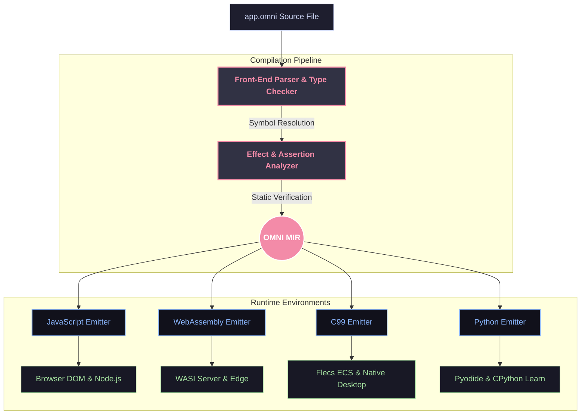

<div align="center">

# 🌌 OmniScript

**The AI-First Programming Language**

*One `.omni` file is a complete app. Powered by a single robust specification, compiled through an intermediate representation (OMNI MIR) to four optimized targets.*

[Explore Spec](OMNI_SPEC.md) • [Our Story](OMNI_HISTORY.md) • [Browse Docs](docs/INDEX.md)

<br>

[](https://github.com/azzouzabdelhak68-ship-it/omni-lang/actions)
[](https://github.com/azzouzabdelhak68-ship-it/omni-lang/actions)
[](https://opensource.org/licenses/MIT)
[](https://www.python.org/downloads/)

</div>

---

## 🎨 Unified Architecture

OmniScript uses **one front-end, one middle representation (OMNI MIR), and four target lanes**. This unique architecture ensures code behavior is 100% consistent across every engine.



---

## ⚡ Pillars of OmniScript

### 1. Checked Effects & Capabilities
Side effects are not left to chance. Every function must declare its capabilities (`uses network`, `reads file`, or `pure`). The compiler statically enforces these contracts—a `pure` function is mathematically guaranteed to have zero side effects.

```omni
# Declares network access. Calling filesystem I/O inside will fail compile time.
fn fetch_user(id: Number) -> Text:
    uses network
    return http_get("api/user/{id}")
end
```

### 2. Live-Link Reactive UI (`UI:`)
No complex React setup or state-management boilerplate. HTML elements instantly bind to variables using `{variable}` value slots and dispatch events using `click="function"`. Renders are automatically batched at block boundaries to prevent flicker and micro-stutters.

```omni
when app starts:
    clicks = 0
end

fn increment() -> None:
    pure
    clicks = clicks + 1
end

UI:
<div class="card">
    <button click="increment">Clicked {clicks} times</button>
</div>
end
```

### 3. Native 3D Graphic Integration (`scene:`)
Build visual, spatial tools with three-dimensional components built into the language. Live-linked values apply seamlessly to meshes, cameras, and lighting.

```omni
scene:
    box size="2" color="{my_color}" pos="0,1,0" click="change_color"
    light type="directional" intensity="1.5"
end
```

---

## 🗺️ Execution Roadmap (v1.0 → v5)

We track progress with uncompromising, automated Quality Gates (95% Branch Coverage, 90% Mutation Score, and strict static analysis):

| Stage | Scope / Features | Status |
| :---: | | :---: |
| **v1.0** | **Core JS MVP**: Universal `:` blocks, Checked Effects, Live-Link DOM, basic compiler | **COMPLETE** |
| **v2.0** | **Loops & 3D**: Loop iteration, Three.js 3D primitives, Struct Custom Types | **COMPLETE** |
| **v3.0** | **Native Systems & WASM**: C99 emitter, Flecs ECS, Bevy Rust, browser WebAssembly | **COMPLETE** |
| **v4.0** | **SMT Proofs & AI Tooling**: Static contract validation (Z3), LSP diagnostics, automatic fixes | **COMPLETE** |
| **v5.0** | **Platform Maturity**: Self-hosting, Visual Editor, Distributed Actor Model | *In Progress* |

---

## 🛸 The `omni` CLI Interface

A CLI built specifically with **AI-first inspection APIs** so LLM agents can query symbols, debug stack traces, and apply structured syntax fixes automatically.

```bash
# Verify static assertion contracts using the SMT solver
omni verify app.omni

# Run the interactive LSP server
omni lsp

# Query compiler metadata about a specific function
omni inspect symbol app.omni fetch_user
```

---

## 🌐 Backend Capabilities Matrix

Different backends provide isolated, compile-time checked hardware capabilities:

| Capability | Native C | WASM | JavaScript | Python |
| :--- | :---: | :---: | :---: | :---: |
| **Network** | 🟢 Yes | 🟢 WASI | 🟢 Yes | 🟢 Yes |
| **Filesystem** | 🟢 Yes | 🟢 WASI | 🟢 Node | 🟢 Yes |
| **GPU/Graphics** | 🟢 Yes | 🟢 WebGPU | 🟢 WebGL | 🔴 No |
| **Processes** | 🟢 Yes | 🔴 No | 🔴 No | 🔴 No |

---

## 🚀 Getting Started

To install dependencies and run conformance tests:

```bash
# Clone the repository
git clone https://github.com/azzouzabdelhak68-ship-it/omni-lang.git
cd omni-lang

# Install dev dependencies
pip install -e ".[dev]"

# Run the complete compiler test suite
pytest
```

---

<div align="center">
Distributed under the MIT License. Created with passion by azzouzabdelhak68-ship-it.
</div>
