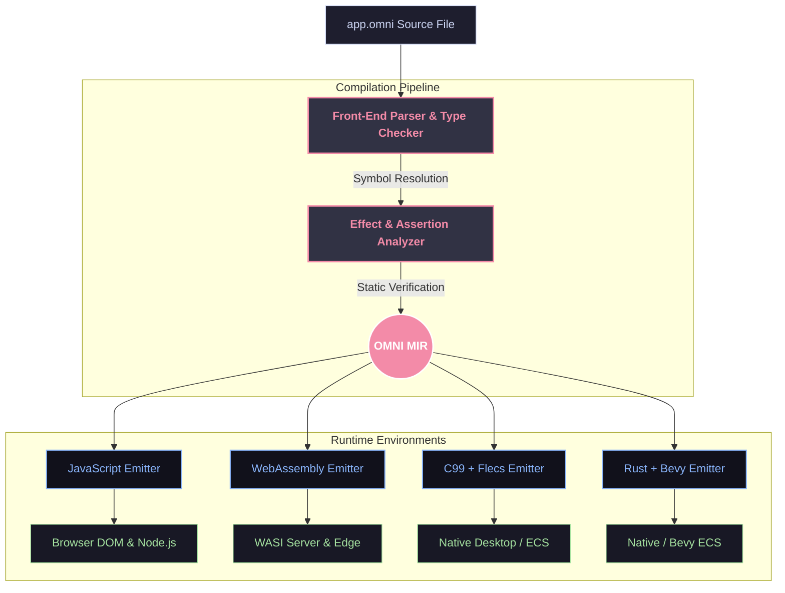

<div align="center" style="background: linear-gradient(135deg, #0b0b14 0%, #1a0b2e 100%); padding: 40px; border-radius: 16px; border: 1px solid rgba(168,85,247,0.3); box-shadow: 0 10px 30px rgba(0,0,0,0.5);">

# 🌌 OmniScript
<h3 style="color: #f472b6; font-weight: 700; letter-spacing: 2px; margin-top: 5px;">THE AI-FIRST PROGRAMMING LANGUAGE</h3>

<p style="color: #cbd5e1; max-width: 650px; line-height: 1.6; font-size: 15px;">
One <code style="color: #e879f9; background: #2e1065; padding: 2px 6px; border-radius: 4px;">.omni</code> file is a complete, verifiable application. Defined by a single rigorous specification, checked by static effect analysis, and compiled through OMNI MIR to multiple targets.
</p>

<p style="margin: 20px 0;">
  <a href="index.html" style="background: #7c3aed; color: #fff; padding: 10px 20px; border-radius: 8px; text-decoration: none; font-weight: bold; display: inline-block; margin-right: 10px;">🌐 Launch Web Dashboard</a>
  <a href="OMNI_SPEC.md" style="background: rgba(124,58,237,0.2); color: #c4b5fd; padding: 10px 20px; border-radius: 8px; text-decoration: none; font-weight: bold; border: 1px solid rgba(124,58,237,0.4); display: inline-block; margin-right: 10px;">📖 Explore Spec</a>
  <a href="docs/INDEX.md" style="background: rgba(56,189,248,0.2); color: #bae6fd; padding: 10px 20px; border-radius: 8px; text-decoration: none; font-weight: bold; border: 1px solid rgba(56,189,248,0.4); display: inline-block;">📚 Docs</a>
</p>

<p style="margin-top: 15px;">
  
  
  
  
</p>

</div>

---

## 📍 System Status

<table style="width: 100%; border-collapse: collapse; background: #0f0f1b; border: 1px solid rgba(168,85,247,0.2); border-radius: 12px; overflow: hidden;">
  <thead>
    <tr style="background: #1e1e3f; color: #e879f9; text-align: left; font-family: monospace; font-size: 13px;">
      <th style="padding: 12px 16px;">LAYER / SUBSYSTEM</th>
      <th style="padding: 12px 16px;">SCOPE & CAPABILITIES</th>
      <th style="padding: 12px 16px;">STATUS</th>
    </tr>
  </thead>
  <tbody style="color: #cbd5e1; font-size: 14px;">
    <tr style="border-top: 1px solid rgba(168,85,247,0.1);">
      <td style="padding: 12px 16px; font-weight: bold; color: #fff;">Language Core (v1–v4)</td>
      <td style="padding: 12px 16px;">Parser, type checker, checked effects, OMNI MIR, diagnostics</td>
      <td style="padding: 12px 16px;"><span style="background: #022c22; color: #34d399; padding: 4px 8px; border-radius: 6px; font-size: 12px; font-weight: bold;">✅ COMPLETE</span></td>
    </tr>
    <tr style="border-top: 1px solid rgba(168,85,247,0.1);">
      <td style="padding: 12px 16px; font-weight: bold; color: #fff;">Native + WASM Lanes (v3)</td>
      <td style="padding: 12px 16px;">C99 & Rust emitters, WASM targets, Flecs/Bevy ECS integration</td>
      <td style="padding: 12px 16px;"><span style="background: #022c22; color: #34d399; padding: 4px 8px; border-radius: 6px; font-size: 12px; font-weight: bold;">✅ COMPLETE</span></td>
    </tr>
    <tr style="border-top: 1px solid rgba(168,85,247,0.1);">
      <td style="padding: 12px 16px; font-weight: bold; color: #fff;">SMT + AI Tooling (v4)</td>
      <td style="padding: 12px 16px;">Z3 contract verification, LSP server, suggest/generate/trace</td>
      <td style="padding: 12px 16px;"><span style="background: #022c22; color: #34d399; padding: 4px 8px; border-radius: 6px; font-size: 12px; font-weight: bold;">✅ COMPLETE</span></td>
    </tr>
    <tr style="border-top: 1px solid rgba(168,85,247,0.1);">
      <td style="padding: 12px 16px; font-weight: bold; color: #fff;">Self-Hosting & Visual Editor (v5)</td>
      <td style="padding: 12px 16px;">296 tests passing, 90.48% branch coverage, block editor</td>
      <td style="padding: 12px 16px;"><span style="background: #022c22; color: #34d399; padding: 4px 8px; border-radius: 6px; font-size: 12px; font-weight: bold;">✅ COMPLETE</span></td>
    </tr>
    <tr style="border-top: 1px solid rgba(168,85,247,0.1);">
      <td style="padding: 12px 16px; font-weight: bold; color: #fff;">OMNISYS Platform (v6)</td>
      <td style="padding: 12px 16px;">Distributed runtime, module implementation & stdlib expansion</td>
      <td style="padding: 12px 16px;"><span style="background: #422006; color: #fbbf24; padding: 4px 8px; border-radius: 6px; font-size: 12px; font-weight: bold;">🚧 IN PROGRESS</span></td>
    </tr>
    <tr style="border-top: 1px solid rgba(168,85,247,0.1);">
      <td style="padding: 12px 16px; font-weight: bold; color: #fff;">Ecosystem Benchmark (v7)</td>
      <td style="padding: 12px 16px;">Multi-project evaluation measuring AI ↔ language friction</td>
      <td style="padding: 12px 16px;"><span style="background: #172554; color: #60a5fa; padding: 4px 8px; border-radius: 6px; font-size: 12px; font-weight: bold;">📋 PLANNED</span></td>
    </tr>
  </tbody>
</table>

> 📊 **Test Suite:** **296 passed**, 3 skipped. Coverage gate: **90.48% ≥ 90%**.

---

## ⚡ Quick Start

```bash
# Install OmniScript development environment
pip install -e ".[dev]"

# Build an .omni application for JavaScript
omni build app.omni --target js

# Execute application directly
omni run app.omni

# Verify static contracts via Z3 SMT solver
omni verify app.omni
```

---

## ☈ Unified Architecture

OmniScript bridges high-level AI generation with deterministic execution via a unified compilation pipeline. One source specification feeds the front-end analyzer into **OMNI MIR**, powering native, WASM, and web emitters.



### Back-End Emitter Status

| Target | Emitter Module | Status | Invocation & Notes |
| :--- | :--- | :--- | :--- |
| **JavaScript** | `emitter.py` | ✅ **SHIPPING** | `omni build app.omni --target js` |
| **Native (C99)** | `c_emitter.py` | ✅ **SHIPPING** | `--target c`, optional Flecs ECS support |
| **WebAssembly** | `wasm_emitter.py` | ⚠️ **EXPERIMENTAL** | Emits C + build guidance; requires `clang` |
| **Rust / Bevy** | `rust_emitter.py` | 🚧 **STUB** | File present, CLI reports "not landed yet" |
| **Python / Pyodide** | — | 📋 **SPEC-ONLY** | Documented in `OMNI_SPEC.md` §13 |

---

## 💬 Core Design Pillars

### 1. Checked Effects & Capabilities
Side effects are explicitly declared and statically enforced. Functions declare capabilities (`uses network`, `reads file`, or `pure`). The compiler guarantees safety at build time.

```omni
# Declares network access. Any unauthorized I/O inside will trigger a compile error.
fn fetch_user(id: Number) -> Text:
    uses network
    return http_get("api/user/{id}")
end
```

### 2. Live-Link Reactive UI (`UI:`)
No virtual DOM overhead or boilerplate state managers. Direct binding of variables `{variable}` with event handlers batched at block boundaries.

```omni
when app starts:
    clicks = 0
end

fn increment() -> None:
    pure
    clicks = clicks + 1
end

UI:
<div class="card">
    <button click="increment">Clicked {clicks} times</button>
</div>
end
```

### 3. Native 3D Graphics (`scene:`)
Spatial primitives built natively into language blocks with live-linked reactive properties for meshes, cameras, and lighting.

```omni
scene:
    box size="2" color="{my_color}" pos="0,1,0" click="change_color"
    light type="directional" intensity="1.5"
end
```

---

## 📊 Roadmap & Milestones

<table style="width: 100%; border-collapse: collapse; background: #0f0f1b; border: 1px solid rgba(168,85,247,0.2); border-radius: 12px; overflow: hidden;">
  <thead>
    <tr style="background: #1e1e3f; color: #e879f9; text-align: left; font-family: monospace; font-size: 13px;">
      <th style="padding: 12px 16px;">STAGE</th>
      <th style="padding: 12px 16px;">MILESTONE & SCOPE</th>
      <th style="padding: 12px 16px;">STATUS</th>
    </tr>
  </thead>
  <tbody style="color: #cbd5e1; font-size: 14px;">
    <tr style="border-top: 1px solid rgba(168,85,247,0.1);">
      <td style="padding: 12px 16px; font-weight: bold; color: #fff; font-family: monospace;">v1</td>
      <td style="padding: 12px 16px;">Core JS MVP: universal blocks, checked effects, live-link DOM, CLI</td>
      <td style="padding: 12px 16px;"><span style="background: #022c22; color: #34d399; padding: 4px 8px; border-radius: 6px; font-size: 12px; font-weight: bold;">✅ COMPLETE</span></td>
    </tr>
    <tr style="border-top: 1px solid rgba(168,85,247,0.1);">
      <td style="padding: 12px 16px; font-weight: bold; color: #fff; font-family: monospace;">v2</td>
      <td style="padding: 12px 16px;">Native + WASM lanes: C99, WebAssembly, structural types</td>
      <td style="padding: 12px 16px;"><span style="background: #022c22; color: #34d399; padding: 4px 8px; border-radius: 6px; font-size: 12px; font-weight: bold;">✅ COMPLETE</span></td>
    </tr>
    <tr style="border-top: 1px solid rgba(168,85,247,0.1);">
      <td style="padding: 12px 16px; font-weight: bold; color: #fff; font-family: monospace;">v3</td>
      <td style="padding: 12px 16px;">SMT + AI Tooling: Z3 verification, LSP server, AST analysis</td>
      <td style="padding: 12px 16px;"><span style="background: #022c22; color: #34d399; padding: 4px 8px; border-radius: 6px; font-size: 12px; font-weight: bold;">✅ COMPLETE</span></td>
    </tr>
    <tr style="border-top: 1px solid rgba(168,85,247,0.1);">
      <td style="padding: 12px 16px; font-weight: bold; color: #fff; font-family: monospace;">v4</td>
      <td style="padding: 12px 16px;">Self-Hosting & Visual Editor: block editor, 296 tests, 90% coverage</td>
      <td style="padding: 12px 16px;"><span style="background: #022c22; color: #34d399; padding: 4px 8px; border-radius: 6px; font-size: 12px; font-weight: bold;">✅ COMPLETE</span></td>
    </tr>
    <tr style="border-top: 1px solid rgba(168,85,247,0.1);">
      <td style="padding: 12px 16px; font-weight: bold; color: #fff; font-family: monospace;">v5</td>
      <td style="padding: 12px 16px;">OMNISYS Platform: distributed actors, cloud modules, standard library</td>
      <td style="padding: 12px 16px;"><span style="background: #422006; color: #fbbf24; padding: 4px 8px; border-radius: 6px; font-size: 12px; font-weight: bold;">🚧 IN PROGRESS</span></td>
    </tr>
    <tr style="border-top: 1px solid rgba(168,85,247,0.1);">
      <td style="padding: 12px 16px; font-weight: bold; color: #fff; font-family: monospace;">v6</td>
      <td style="padding: 12px 16px;">Ecosystem Benchmark: 31 production simulations & friction analysis</td>
      <td style="padding: 12px 16px;"><span style="background: #172554; color: #60a5fa; padding: 4px 8px; border-radius: 6px; font-size: 12px; font-weight: bold;">📋 PLANNED</span></td>
    </tr>
  </tbody>
</table>

---

## 📈 By The Numbers

| Metric | Value | Status / Description |
| :--- | :--- | :--- |
| **Tests Passed** | `296` | 100% core test suite green |
| **Tests Skipped** | `3` | Environment-dependent (gcc/cargo) |
| **Target Runtimes** | `6+` | JS, WASI, C99, Bevy, Pyodide, Custom ECS |
| **Source Language** | `1` | Universal `.omni` specification |
| **Possibilities** | `∞` | AI-first verifiable architecture |

---

<div align="center" style="background: #0f0f1b; padding: 25px; border-radius: 12px; border: 1px solid rgba(168,85,247,0.2);">

<span style="color: #fbbf24; font-weight: bold; font-size: 15px;">⭐ SPEC FIRST. VERIFIED ALWAYS. RUN ANYWHERE.</span>

<p style="color: #94a3b8; font-size: 13px; margin-top: 8px;">Built with ❤️ by the OmniScript Community.</p>

</div>
