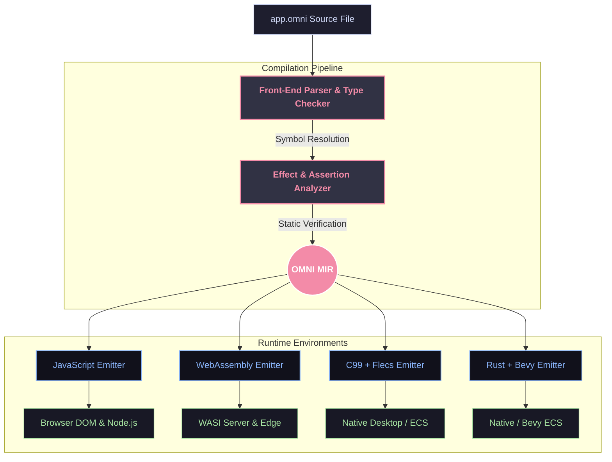

<div align="center">

# 🌌 OmniScript

### **THE AI-FIRST PROGRAMMING LANGUAGE**

*One `.omni` file is a complete, verifiable application. Defined by a single rigorous specification, checked by static effect analysis, compiled through OMNI MIR to multiple native and web targets.*

[Explore Spec](OMNI_SPEC.md) &nbsp;•&nbsp; [Our Story](OMNI_HISTORY.md) &nbsp;•&nbsp; [Browse Docs](docs/INDEX.md)

<br>

[](https://github.com/azzouzabdelhak68-ship-it/omni-lang/actions)
[](https://github.com/azzouzabdelhak68-ship-it/omni-lang/actions)
[](https://opensource.org/licenses/MIT)
[](https://www.python.org/downloads/)

</div>

---

## 📍 System Status

| Layer / Subsystem | Scope & Capabilities | Status |
| :--- | :--- | :--- |
| **Language Core (v1–v4)** | Parser, type checker, checked effects, OMNI MIR, diagnostics | ✅ **COMPLETE** |
| **Native + WASM Lanes (v3)** | C99 & Rust emitters, WASM targets, Flecs/Bevy ECS integration | ✅ **COMPLETE** |
| **SMT + AI Tooling (v4)** | Z3 contract verification, LSP server, `suggest`/`generate`/`trace` | ✅ **COMPLETE** |
| **Self-Hosting & Visual Editor (v5)** | 296 tests passing, 90.48% branch coverage, block editor, actor model | ✅ **COMPLETE** |
| **OMNISYS Platform (v6)** | Distributed runtime, module implementation & stdlib expansion | 🚧 **IN PROGRESS** |
| **Ecosystem Benchmark (v7)** | Multi-project evaluation measuring AI ↔ language friction | 📋 **PLANNED** |

> 📊 **Test Suite:** **296 passed**, 3 skipped (requires gcc/cargo). Coverage gate: **90.48% ≥ 90%**.

---

## ⚡ Quick Start

```bash
# Install OmniScript development environment
pip install -e ".[dev]"

# Build an .omni application for JavaScript
omni build app.omni --target js

# Execute application directly
omni run app.omni

# Verify static contracts via Z3 SMT solver
omni verify app.omni
```

---

## ☈ Unified Architecture

OmniScript bridges high-level AI generation with deterministic execution via a unified compilation pipeline. One source specification feeds the front-end analyzer into **OMNI MIR**, powering native, WASM, and web emitters.



### Back-End Emitter Status

| Target | Emitter Module | Status | Invocation & Notes |
| :--- | :--- | :--- | :--- |
| **JavaScript** | `emitter.py` | ✅ **SHIPPING** | `omni build app.omni --target js` |
| **Native (C99)** | `c_emitter.py` | ✅ **SHIPPING** | `--target c`, optional Flecs ECS support |
| **WebAssembly** | `wasm_emitter.py` | ⚠️ **EXPERIMENTAL** | Emits C + build guidance; requires `clang` |
| **Rust / Bevy** | `rust_emitter.py` | 🚧 **STUB** | File present, CLI reports "not landed yet" |
| **Python / Pyodide** | — | 📋 **SPEC-ONLY** | Documented in `OMNI_SPEC.md` §13 |

---

## 💬 Core Design Pillars

### 1. Checked Effects & Capabilities
Side effects are explicitly declared and statically enforced. Functions declare capabilities (`uses network`, `reads file`, or `pure`). The compiler guarantees safety at build time.

```omni
# Declares network access. Any unauthorized I/O inside will trigger a compile error.
fn fetch_user(id: Number) -> Text:
    uses network
    return http_get("api/user/{id}")
end
```

### 2. Live-Link Reactive UI (`UI:`)
No virtual DOM overhead or boilerplate state managers. Direct binding of variables `{variable}` with event handlers batched at block boundaries.

```omni
when app starts:
    clicks = 0
end

fn increment() -> None:
    pure
    clicks = clicks + 1
end

UI:
<div class="card">
    <button click="increment">Clicked {clicks} times</button>
</div>
end
```

### 3. Native 3D Graphics (`scene:`)
Spatial primitives built natively into language blocks with live-linked reactive properties for meshes, cameras, and lighting.

```omni
scene:
    box size="2" color="{my_color}" pos="0,1,0" click="change_color"
    light type="directional" intensity="1.5"
end
```

---

## 📊 Roadmap

| Stage | Milestone | Status |
| :---: | :--- | :---: |
| **v1** | Core JS MVP: universal blocks, checked effects, live-link DOM, CLI | ✅ **COMPLETE** |
| **v2** | Native + WASM lanes: C99, WebAssembly, structural types | ✅ **COMPLETE** |
| **v3** | SMT + AI Tooling: Z3 verification, LSP server, AST analysis | ✅ **COMPLETE** |
| **v4** | Self-Hosting & Visual Editor: block editor, 296 tests, 90% coverage | ✅ **COMPLETE** |
| **v5** | OMNISYS Platform: distributed actors, cloud modules, standard library | 🚧 **IN PROGRESS** |
| **v6** | Ecosystem Benchmark: 31 production simulations & friction analysis | 📋 **PLANNED** |

---

## 📈 By The Numbers

| Metric | Value | Status / Description |
| :--- | :--- | :--- |
| **Tests Passed** | `296` | 100% core test suite green |
| **Tests Skipped** | `3` | Environment-dependent (gcc/cargo) |
| **Branch Coverage** | `90.48%` | Exceeds 90% strict coverage gate |
| **Target Runtimes** | `6+` | JS, WASI, C99, Bevy, Pyodide, Custom ECS |
| **Source Language** | `1` | Universal `.omni` specification |
| **Possibilities** | `∞` | AI-first verifiable architecture |

---

<div align="center">

⭐ **SPEC FIRST. VERIFIED ALWAYS. RUN ANYWHERE.**

Built with ❤️ by the OmniScript Community.

</div>
