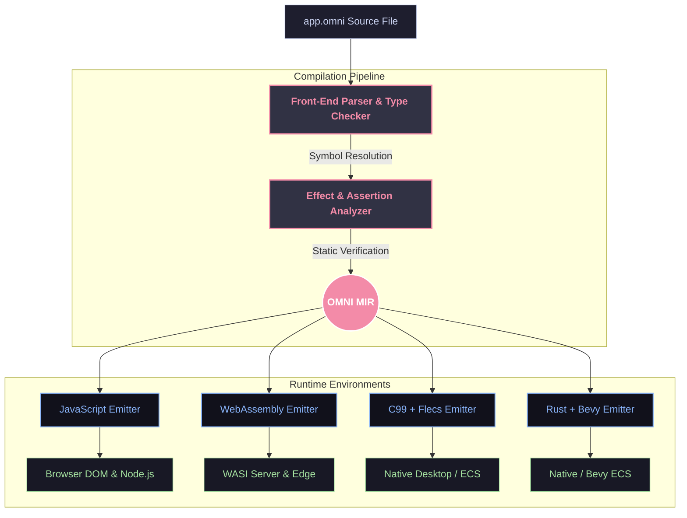

<div align="center">

# 🌌 OmniScript

**The AI-First Programming Language**

*One `.omni` file is a complete app. Defined by a single specification, checked by a rigorous front-end, compiled through OMNI MIR to multiple targets.*

[Explore Spec](OMNI_SPEC.md) • [Our Story](OMNI_HISTORY.md) • [Browse Docs](docs/INDEX.md)

<br>

[](https://github.com/azzouzabdelhak68-ship-it/omni-lang/actions)
[](https://github.com/azzouzabdelhak68-ship-it/omni-lang/actions)
[](https://opensource.org/licenses/MIT)
[](https://www.python.org/downloads/)

</div>

---

## 📍 Status

| | |
|---|---|
| **Language core (v1–v4)** | ✅ **Complete** — parser, type checker, checked effects, OMNI MIR, diagnostics |
| **Native + WASM lanes (v3)** | ✅ **Complete** — C99 & Rust emitters, WASM targets, Flecs/Bevy adapters |
| **SMT + AI tooling (v4)** | ✅ **Complete** — Z3 contract verification, LSP server, `suggest`/`generate`/`trace` |
| **Self-hosting, visual editor, distributed (v5)** | ✅ **Complete** — 296 tests passing, 90.48% branch coverage |
| **OMNISYS platform (v6)** | 🚧 **In progress** — docs layer complete; module implementations under development |
| **Ecosystem benchmark (v7)** | 📋 Planned |

*Test suite: **296 passed, 3 skipped** (skips need gcc/cargo). Coverage gate **90.48% ≥ 90%**.*

---

## 🎨 Unified Architecture

OmniScript uses **one front-end, one middle representation (OMNI MIR), and multiple target lanes**. Code behavior is consistent across every engine — the spec is the authority.



### Back-end status

| Target | Emitter | Status |
| :--- | :--- | :--- |
| **JavaScript** | `emitter.py` | ✅ Shipping — `omni build --target js` |
| **Native (C99)** | `c_emitter.py` | ✅ Shipping — `--target c`, optional Flecs ECS |
| **WebAssembly** | `wasm_emitter.py` | ⚠️ Experimental — emits C + build guidance; needs clang to produce `.wasm` |
| **Rust / Bevy** | `rust_emitter.py` | 🚧 Stub — file present, CLI reports "not landed yet" |
| **Python / Pyodide** | — | 📋 Spec-only — listed in `OMNI_SPEC.md` §13, emitter not yet implemented |

---

## ⚡ Core Ideas

### 1. Checked Effects & Capabilities
Side effects are not left to chance. Every function must declare its capabilities (`uses network`, `reads file`, or `pure`). The compiler statically enforces these contracts — a `pure` function is guaranteed to have zero side effects.

```omni
# Declares network access. Calling filesystem I/O inside will fail at compile time.
fn fetch_user(id: Number) -> Text:
    uses network
    return http_get("api/user/{id}")
end
```

### 2. Live-Link Reactive UI (`UI:`)
No complex state-management boilerplate. HTML elements bind to variables with `{variable}` value slots and dispatch events with `click="function"`. Renders are batched at block boundaries to prevent flicker.

```omni
when app starts:
    clicks = 0
end

fn increment() -> None:
    pure
    clicks = clicks + 1
end

UI:
<div class="card">
    <button click="increment">Clicked {clicks} times</button>
</div>
end
```

### 3. Native 3D Graphics (`scene:`)
Visual, spatial tools built into the language. Live-linked values apply to meshes, cameras, and lighting.

```omni
scene:
    box size="2" color="{my_color}" pos="0,1,0" click="change_color"
    light type="directional" intensity="1.5"
end
```

---

## 🗺️ Roadmap

<td>| Stage | Scope | Status |</td>
| :---: | | :---: |
<td>| **v1** | Core JS MVP: universal `:` blocks, checked effects, live-link DOM, CLI | ✅ Complete |</td>
| **v2** | Loops, Three.js 3D primitives, struct custom types | ✅ Complete |
| **v3** | C99 + Flecs, Rust + Bevy, WASM targets, cross-backend conformance | ✅ Complete |
| **v4** | Z3 SMT contract proofs, LSP, automatic fixes, test generation | ✅ Complete |
| **v5** | Self-hosting compiler, visual editor, distributed actors | ✅ Complete |
| **v6** | OMNISYS platform: `import OMNISYS`, module registry, stdlib | 🚧 In progress |
| **v7** | Ecosystem benchmark: 31 projects measuring AI ↔ language friction | 📋 Planned |

---

## 🛠️ The `omni` CLI

A CLI built with **AI-first inspection APIs** so agents can query symbols, trace execution, and apply structured fixes automatically.

```bash
# Check syntax, types, and effects
omni check app.omni

# Run the app (JS target)
omni run app.omni

# Verify assertion contracts statically via the Z3 SMT solver
omni verify app.omni

# Query compiler metadata about a symbol
omni inspect symbol app.omni fetch_user

# Run the interactive LSP server
omni lsp
```

---

## 📦 Repository Layout

```
omni-lang/
├── omni_compiler/     # Front-end, MIR, type checker, effect analyzer, emitters, CLI
├── cmake/             # Native build integration
├── docs/              # Spec-linked architecture, decisions, and module docs
├── examples/          # Sample .omni applications
├── tests/             # pytest + hypothesis property tests, conformance suites
├── scripts/           # Docs verification, perf/bundle gates
├── self_hosted/       # v5 self-hosted compiler work
├── simulation_engine/ # Runtime support for the sim.* standard library
├── visual_editor/     # v5 block-based visual editor
├── OMNI_SPEC.md       # The single official language specification
└── OMNI_HISTORY.md    # The story of how OmniScript was created
```

> **Note:** the OMNISYS module suite (`packages/omnisys-*`, `omnisys/` runtime) is under development and not yet part of this repository's published tree.

---

## 🚀 Getting Started

```bash
git clone https://github.com/azzouzabdelhak68-ship-it/omni-lang.git
cd omni-lang

pip install -e ".[dev]"

pytest
```

---

<div align="center">
Distributed under the MIT License. Created by AZZOUZ abdelhak.
</div>
